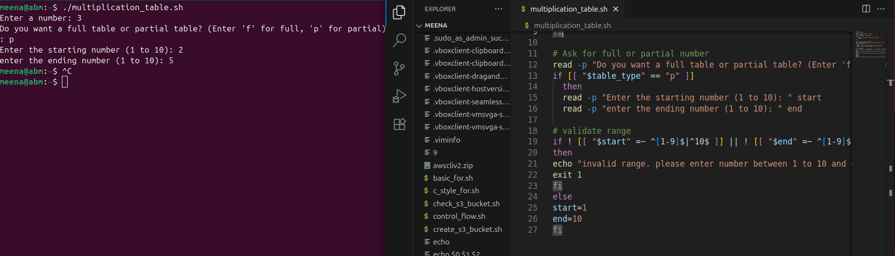
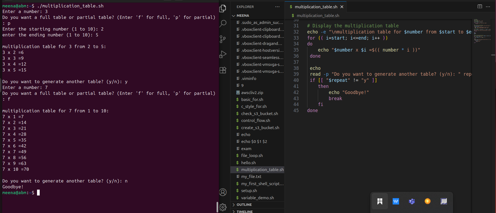
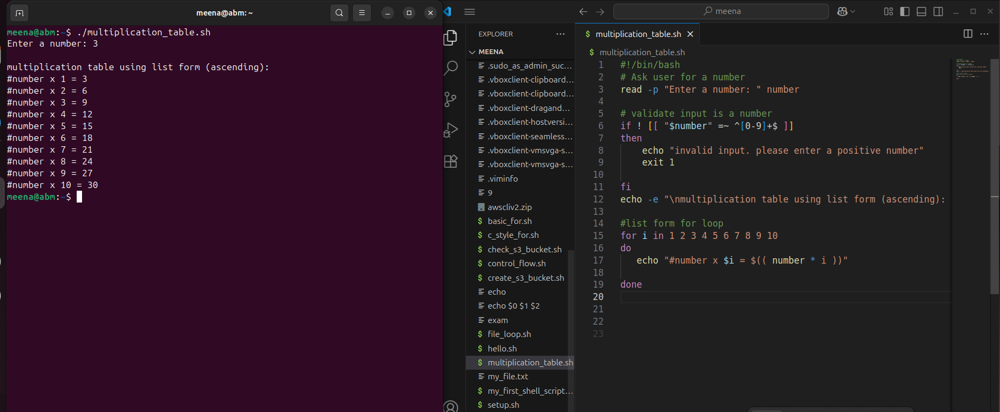
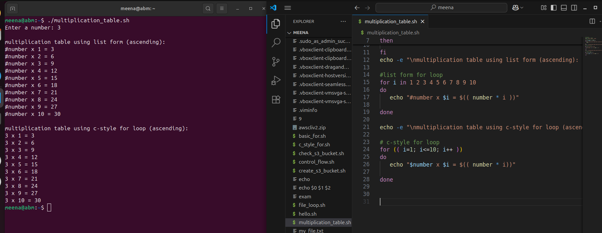

# Capstone_Project_Linux_Shell_Scripting
# Introduction.
In this project we are going to crate a bash script that generates a multiplication table for a number entered by user.

# 1. basic input
starting with reading the number from the user and printing the full table.

# 2. Ask full or partial
Add logic to ask user if they want a full or partial table.

# 3. Display multiplication table

# TASK

## using list form for loop

## using C-style for loop.

.